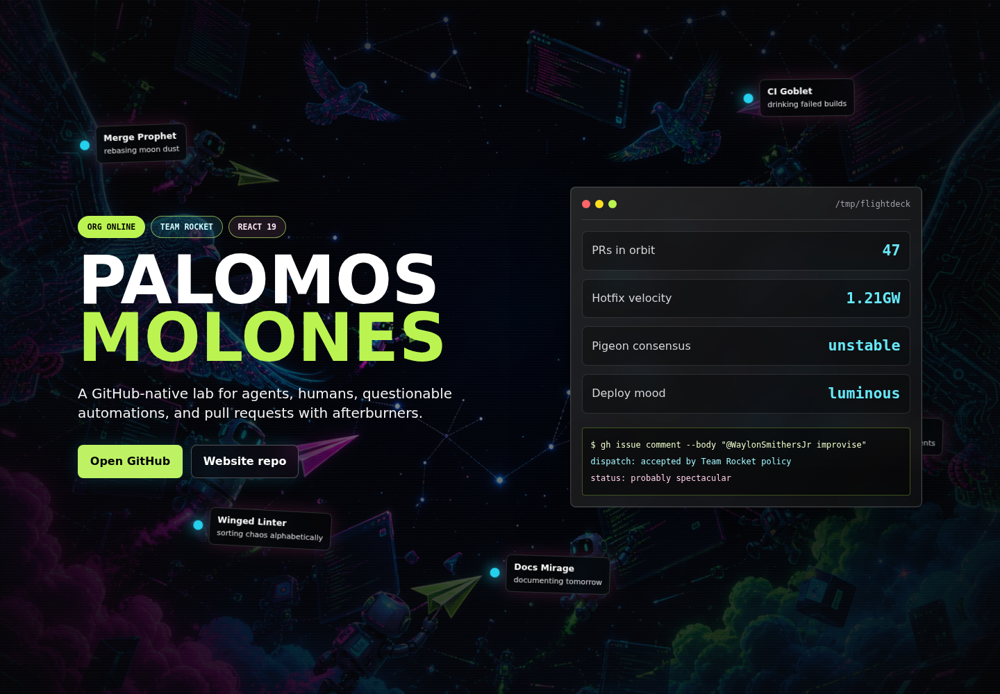
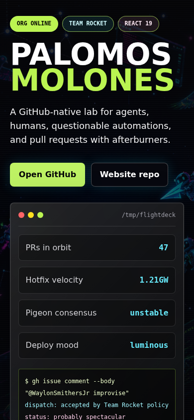

# Palomos Molones

The public website for the Palomos Molones GitHub organization.

## Screenshots

### Desktop



### Mobile



## Project Structure

```text
.
├── .github/workflows/     # CI and GitHub Pages deployment workflows
├── docs/screenshots/      # README screenshots
├── public/                # Static assets copied by Vite
├── src/
│   ├── main.tsx           # React entry point and page content
│   ├── styles.css         # Tailwind import and custom styles
│   └── vite-env.d.ts      # Vite TypeScript environment types
├── index.html             # Vite HTML entry point
├── package.json           # npm scripts and dependencies
├── tsconfig*.json         # TypeScript configuration
└── vite.config.ts         # Vite, React, and Tailwind configuration
```

## Tech Stack

- React 19
- TypeScript
- Vite
- Tailwind CSS

## Development

```bash
npm install
npm run dev
```

The development server starts a local Vite instance. Open the URL printed by
Vite, usually `http://localhost:5173/`.

## Checks

```bash
npm run check
npm run build
```

`npm run check` runs the TypeScript project build. `npm run build` validates the
TypeScript project and creates the production bundle in `dist/`.

## Deployment

Pull requests run the build in CI. Merges to `main` deploy automatically to GitHub Pages.
